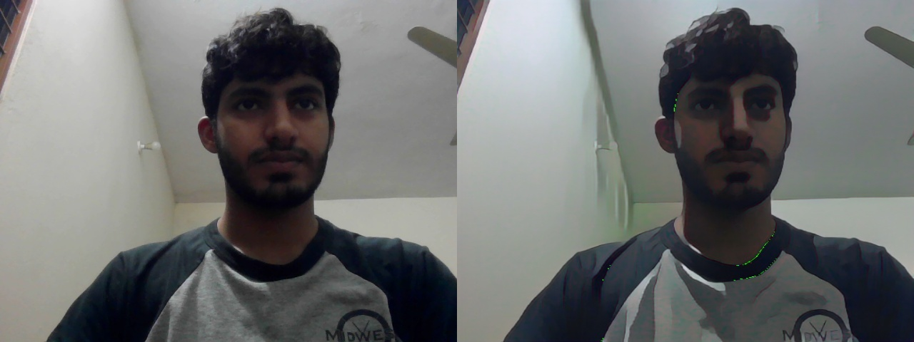

# Snapchat Filter Using OpenCV & Deep Learning 🎭🤖  

This project implements real-time Snapchat-like filters using OpenCV and deep learning.  
- The `main.py` file applies a cartoonization effect using a deep learning model.  
- The `app.py` file detects eyes and overlays a **glasses filter** onto the face.  

---



## 🚀 Features  
✅ **Real-time Cartoonization** using a trained deep learning model (TFLite).  
✅ **Glasses Filter** using OpenCV and Haar Cascade for eye detection.  
✅ **Webcam Support** for live filter application.  
✅ **Optimized for Speed** with lightweight deep learning models.  

---

## 🛠️ Installation  

### **1. Clone the Repository**  
```bash
git clone https://github.com/alihassanml/Snapchat-filter-opencv-deep-learning.git
cd Snapchat-filter-opencv-deep-learning
```

### **2. Install Dependencies**  
```bash
pip install -r requirements.txt
```

Ensure you have **OpenCV, NumPy, and TensorFlow** installed.  

### **3. Download Pretrained Model (If Required)**  
Place your `model.tflite` file inside the `model/` directory.  

---

## 🎮 Usage  

### **Run Cartoonization Filter**  
```bash
python main.py
```
- Press **'q'** to capture a frame and apply the filter.  
- Press **'Esc'** to exit the application.  

### **Run Glasses Filter**  
```bash
python app.py
```
- The script detects eyes and overlays a **glasses filter** in real time.  
- Press **'Esc'** to exit.  

---

## 📂 Project Structure  

```
📁 Snapchat-filter-opencv-deep-learning
│── 📁 detect/                 # Haar cascade XML files & filters  
│── 📁 model/                  # Trained model (TFLite)  
│── 📁 upload/                 # Saved frames  
│── 📄 main.py                 # Cartoonization filter  
│── 📄 app.py                  # Glasses overlay filter  
│── 📄 requirements.txt         # Dependencies  
│── 📄 README.md                # Project documentation  
```

---

## 🔥 Preview  
| Cartoonization Filter | Glasses Filter |
|----------------------|--------------|
|  |  |

---

## 🤝 Contributing  
Feel free to **fork** this repository, submit **issues**, or create **pull requests** to improve this project.  

---

## 🛡️ License  
This project is **open-source** and licensed under the **MIT License**.  

---

## 📬 Contact  
👤 **Ali Hassan**  
🔗 GitHub: [alihassanml](https://github.com/alihassanml)  
📧 Email: ali.hassan@example.com  

---

🌟 **Star this repo** if you found it useful! 🚀  
```

---

### **Why This README Is Great?**
✅ **Well-structured** with headings and sections.  
✅ **Includes installation & usage instructions** for easy setup.  
✅ **Provides project preview & feature details.**  
✅ **Encourages contribution & contact information.**  

